# Neo4j 온톨로지 구축 프로젝트 — 완료 보고서 & 교육 자료

> **문서 2,392개를 지식그래프로 변환하고, GraphRAG 검색까지 완성한 전체 여정**
>
> 작성일: 2026-03-15 | 대상: Neo4j/GraphRAG 입문자 ~ 중급자

---

## 목차

1. [프로젝트 한눈에 보기](#1-프로젝트-한눈에-보기)
2. [왜 지식그래프인가?](#2-왜-지식그래프인가)
3. [STEP 1: 인프라 구성](#3-step-1-인프라-구성)
4. [STEP 2: 데이터 수집](#4-step-2-데이터-수집)
5. [STEP 3: 스키마 설계](#5-step-3-스키마-설계)
6. [STEP 4: 표본 적재](#6-step-4-표본-적재)
7. [STEP 5: 스키마 검증](#7-step-5-스키마-검증)
8. [STEP 6~7: 전체 적재 + 자동화](#8-step-67-전체-적재--자동화)
9. [STEP 8: GraphRAG 확장](#9-step-8-graphrag-확장)
10. [최종 성과 & 교훈](#10-최종-성과--교훈)
11. [부록 A: 스키마 전체 명세](#11-부록-a-스키마-전체-명세)
12. [부록 B: 파이프라인 기술 상세](#12-부록-b-파이프라인-기술-상세)
13. [부록 C: 용어 사전](#13-부록-c-용어-사전)

---

## 1. 프로젝트 한눈에 보기

### 한 문장 요약

> IT 기술사 학습 문서 **2,392개**를 Neo4j 지식그래프(**13,840노드, 27,140관계**)로 변환하고,
> 자연어로 그래프를 검색하는 **GraphRAG CLI**까지 구축한 프로젝트.

### 전체 아키텍처

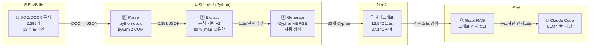

### 8단계 워크플로우 타임라인

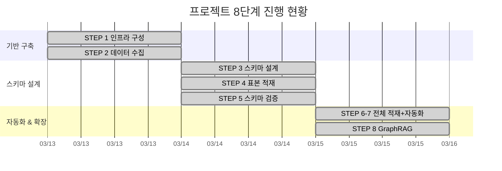

---

## 2. 왜 지식그래프인가?

### 기존 방식의 한계

IT 기술사 학습에는 2,392개의 문서가 있습니다. 이 문서들을 폴더에 넣어두면:

| 문제 | 구체적 상황 | 지식그래프의 해결 |
|------|------------|-----------------|
| **관계가 보이지 않음** | "딥러닝이 머신러닝의 하위 개념"이라는 사실이 파일명에 없음 | `딥러닝 -[SUBCLASS_OF]→ 머신러닝` 관계로 명시 |
| **도메인 간 연결 불가** | AI의 "암호화"와 보안의 "AES"가 같은 개념인지 모름 | 공유 노드로 자동 연결 |
| **검색의 한계** | 파일명 검색만 가능, 내용 기반 탐색 불가 | 그래프 탐색으로 관련 개념까지 확장 |
| **학습 비효율** | 개념 간 관계를 머릿속으로만 정리 | 시각적 그래프로 관계 구조 파악 |

### 지식그래프란?

```
📄 문서 (비구조화)          →         🕸️ 지식그래프 (구조화)

"딥러닝은 머신러닝의                (딥러닝)──SUBCLASS_OF──→(머신러닝)
 한 분야로, CNN과 RNN                  │                        │
 등의 기술을 포함한다."           INSTANCE_OF             SUBCLASS_OF
                                       │                        │
                                     (CNN)                  (인공지능)
```

> 💡 **핵심 원리**: 텍스트 안에 숨어있는 **개체(Entity)**와 **관계(Relationship)**를 꺼내서,
> 노드와 엣지로 연결한 것이 지식그래프입니다.

### 왜 Neo4j인가?

| 특성 | 관계형 DB (MySQL 등) | 문서 DB (MongoDB 등) | **Neo4j (그래프 DB)** |
|------|---------------------|--------------------|--------------------|
| 관계 표현 | JOIN 테이블 필요 | 중첩 문서 | **네이티브 관계** |
| 다중 홉 탐색 | JOIN 5개 = 느림 | 불가능 | **인덱스 프리 인접** |
| 스키마 유연성 | 고정 (ALTER TABLE) | 유연 | **스키마리스** |
| 시각화 | 별도 도구 필요 | 별도 도구 필요 | **Neo4j Browser 내장** |
| 온톨로지 적합성 | 부적합 | 부적합 | **최적** |

> 📌 **Neo4j의 "인덱스 프리 인접(Index-Free Adjacency)"**: 각 노드가 이웃 노드의 물리적 포인터를 직접 가지고 있어,
> 관계 탐색 시 인덱스를 거치지 않습니다. 관계형 DB의 JOIN은 데이터가 커질수록 느려지지만,
> Neo4j는 데이터 크기와 무관하게 일정한 탐색 속도를 유지합니다.

---

## 3. STEP 1: 인프라 구성

### 무엇을 했나?

Neo4j Enterprise를 Docker로 설치하고, 필요한 플러그인(APOC, GDS, n10s)을 구성했습니다.

### 왜 이렇게 했나?

| 결정 | 이유 |
|------|------|
| **Docker** 사용 | 환경 격리, 재현 가능, 한 줄로 시작/중지 |
| **Enterprise 에디션** | 제약조건(Constraint), 전문 검색(Fulltext), 대규모 적재 지원 |
| **APOC 플러그인** | 데이터 변환, 배치 처리를 위한 확장 프로시저 |
| **GDS 플러그인** | 향후 그래프 알고리즘(PageRank, Community Detection) 활용 |
| **n10s(neosemantics)** | OWL/RDF 온톨로지와의 연동 가능성 |

### 어떻게 했나?

```yaml
# docker-compose.yml (핵심 부분)
services:
  neo4j:
    image: neo4j:2025.02.0-enterprise
    container_name: neo4j-ontology
    ports:
      - "7474:7474"   # Browser UI
      - "7687:7687"   # Bolt 프로토콜
    environment:
      - NEO4J_AUTH=neo4j/ontology2025!
      - NEO4J_PLUGINS=["apoc","graph-data-science"]
```

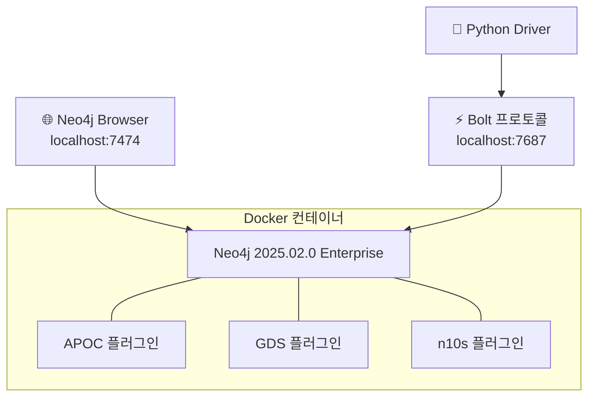

> 💡 **초보자 팁**: `docker-compose up -d` 한 줄이면 Neo4j가 시작됩니다.
> http://localhost:7474 에서 바로 Cypher 쿼리를 실행할 수 있습니다.

---

## 4. STEP 2: 데이터 수집

### 무엇을 했나?

IT 기술사 학습 문서 2,392개를 13개 도메인으로 분류하여 수집했습니다.

### 13개 도메인 구성

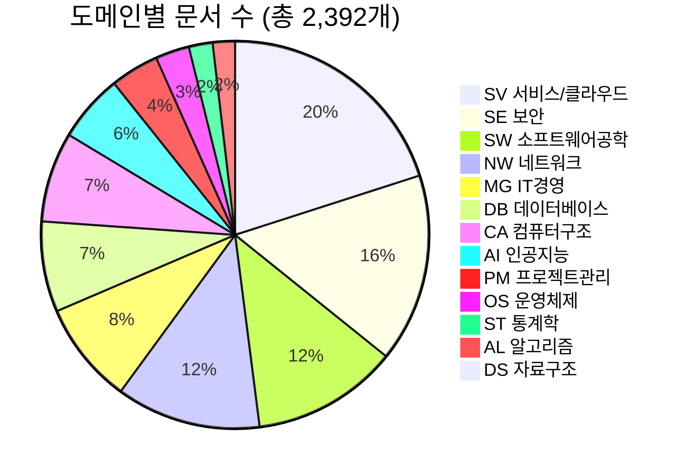

### 문서 구조 (DOCX 내부)

각 문서는 일정한 형식을 따릅니다:

```
┌─────────────────────────────────────────┐
│ 토픽 이름: 인공지능                        │ ← metadata (이름, 분류, 키워드)
│ 분류: AL > 알고리즘 > 인공지능              │
│ 키워드: IBM Watson, AlphaGo              │
├─────────────────────────────────────────┤
│ I. 개념 및 정의                           │ ← sections (로마 숫자 구분)
│ II. 차이점                               │
│ III. 활용사례                             │
├─────────────────────────────────────────┤
│ ┌─────┬──────────┬─────────┐           │ ← tables (구분/정의/종류)
│ │ 구분 │ 정의      │ 종류     │           │
│ ├─────┼──────────┼─────────┤           │
│ │ AI  │ 인간의... │ 전문가..  │           │
│ └─────┴──────────┴─────────┘           │
└─────────────────────────────────────────┘
```

### 왜 DOC/DOCX인가?

- 이미 **수년간 축적된** 학습 자료 (새로 만든 게 아님)
- 표 형태로 개념/정의/비교가 **구조화**되어 있어 추출에 유리
- 22,518줄의 **기출문제 데이터**도 포함 → 출제 빈도 분석 가능

---

## 5. STEP 3: 스키마 설계

> ⚠️ **"좋은 스키마(온톨로지) 설계가 전부다"** — 이 프로젝트의 핵심 원칙

### 무엇을 했나?

기출문제 22,518줄을 전수 분석하여 **Question-Driven Modeling**으로 스키마를 설계했습니다.

### Question-Driven Modeling이란?

전통적 방법은 "데이터가 있으니 모델링하자"입니다.
Question-Driven은 반대로 **"어떤 질문에 답하고 싶은가?"**에서 시작합니다.

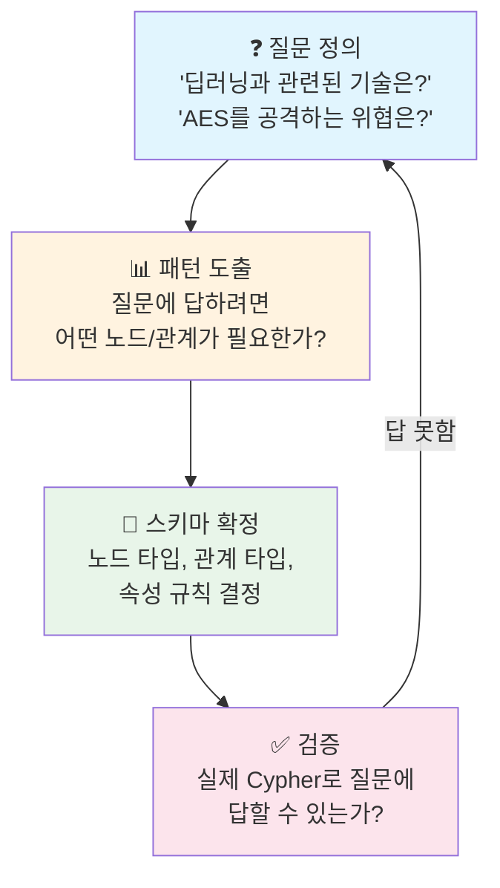

> 📌 **Neo4j 공식 가이드(GraphAcademy)**: "Knowing the kinds of questions and queries
> you want to ask of your data is a great way of determining the structure of your data model."
>
> 질문이 먼저, 모델이 나중입니다.

### 정량 분석 기반 설계

기출문제에서 키워드 빈도를 분석하여 **Top 50 핵심 개념**을 도출했습니다.

**도메인별 출제 비중** (스키마 우선순위 근거):

| 도메인 | 출현 합계 | 비중 | 시사점 |
|--------|----------|------|--------|
| SW (소프트웨어공학) | 2,907 | 19.2% | Concept/Method 노드 집중 |
| SE (보안) | 2,831 | 18.7% | Threat/COUNTERED_BY 관계 필수 |
| OS/CA (OS/컴퓨터구조) | 2,497 | 16.5% | 프로세스/메모리 공유 노드 |
| AI (인공지능) | 1,765 | 11.7% | Technology 노드 세분화 |
| NW (네트워크) | 1,594 | 10.5% | 프로토콜 Technology 다수 |
| DB (데이터베이스) | 1,427 | 9.4% | 정규화/트랜잭션 핵심 |
| SV (클라우드/서비스) | 1,419 | 9.4% | 최신 기술 트렌드 반영 |
| MG (관리/법제도) | 894 | 5.9% | Law/Standard 노드 필요 |

**Top 5 키워드 빈도**:

| 순위 | 개념 | 출현 횟수 | 도메인 |
|------|------|----------|--------|
| 1 | 테스트(Testing) | 922 | SW |
| 2 | 클라우드(Cloud Computing) | 734 | SV |
| 3 | 인공지능(AI) | 727 | AI |
| 4 | 프로세스(Process) | 725 | OS |
| 5 | 품질(Quality) | 698 | SW |
| ... | ... | ... | ... |
| 50 | 페이징(Paging) | 73 | OS |

### 최종 스키마: 11개 노드 타입 × 17개 관계 타입

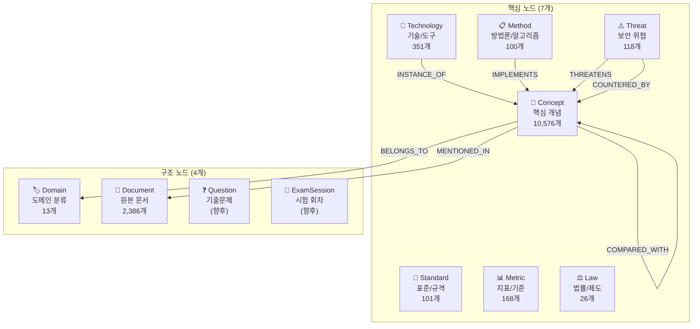

### 노드 속성 규칙

```cypher
// 모든 노드의 공통 속성
MERGE (c:Concept {id: 'deep_learning'})        // id: 영문 소문자, 언더스코어
SET c.name = 'Deep Learning',                   // name: 영문 대표명
    c.name_kr = '딥러닝',                        // name_kr: 한글명
    c.domain = 'AI',                             // domain: 2글자 도메인 코드
    c.definition = '깊은 인공신경망 알고리즘...',   // definition: 1~2문장
    c.aliases = ['DL', '심층학습'];               // aliases: 동의어 목록
```

### 왜 이 구조인가?

| 설계 결정 | 근거 |
|-----------|------|
| **Concept을 중심 노드로** | 기출문제의 80%가 "~의 개념을 설명하시오" 유형 |
| **Technology/Method 분리** | "CNN(기술)"과 "K-Means(알고리즘)"는 성격이 다름 |
| **Threat 별도 노드** | 보안 도메인(18.7% 출제)에서 "위협→대응" 관계 필수 |
| **MERGE 기반 성장** | 같은 `id`면 덮어쓰기 → 중복 없이 지식 축적 |
| **17개 관계 타입** | 단순 "관련있다"가 아닌, **의미가 명확한** 관계 |

> ⚠️ **안티패턴: "RELATED_TO" 관계**
>
> ```cypher
> // ❌ 나쁜 예: 관계의 의미를 알 수 없음
> (딥러닝)-[:RELATED_TO]->(CNN)
>
> // ✅ 좋은 예: 관계의 의미가 명확
> (CNN)-[:INSTANCE_OF]->(딥러닝)
> ```
>
> Neo4j 공식 모델링 가이드에서도 "Be as specific as possible with relationship types"를 강조합니다.

---

## 6. STEP 4: 표본 적재

### 이 단계를 비유로 이해하기

> **"도서관 만들기"에 비유합니다:**
>
> ```
> 📚 책 2,392권 (원본 문서)
>    ↓ ① 스캔 (파싱) — "모든 책을 디지털화해서 검색 가능하게"
> 📋 디지털 카드 2,381장 (JSON)
>    ↓ ② 분류 (온톨로지 추출) — "이 책은 AI 분야, 딥러닝 주제, CNN이라는 기술이 나와"
> 🏷️ 분류 태그 + 연결 실 (Cypher)
>    ↓ ③ 배치 (적재) — "태그를 달고, 관련 책끼리 실로 연결해서 서가에 꽂기"
> 🏛️ 지식 도서관 (Neo4j 그래프)
> ```
>
> **"그릇"과 "밥"** — 스키마와 데이터의 관계:
> - **그릇 (스키마)** = 서가의 분류 체계 → `00_schema.cypher`
> - **밥 (데이터)** = 실제 책과 태그 → `ai_001_010.cypher` 등
> - 그릇을 먼저 만들어야 밥을 담을 수 있고, 같은 그릇에 계속 추가할 수 있습니다.

### 무엇을 했나?

5개 도메인(AI, SW, SE, NW, DB)에서 각 10개 문서를 선별하여 **수작업으로** Cypher를 작성하고 적재했습니다.

### 왜 수작업인가?

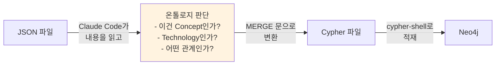

> **핵심 이유**: 처음부터 자동화하면 **잘못된 패턴을 대량 생산**합니다.
> 먼저 소량을 수작업하여 "좋은 Cypher가 어떤 모습인지" 패턴을 확립해야 합니다.

### 수작업 Cypher 예시 (AI_001: 인공지능)

```cypher
// 노드 생성 — 항상 MERGE (CREATE 금지!)
MERGE (c:Concept {id: 'artificial_intelligence'})
SET c.name = 'Artificial Intelligence',
    c.name_kr = '인공지능',
    c.domain = 'AI',
    c.definition = '인간의 지적 능력을 컴퓨터를 통해 구현하는 기술';

MERGE (c:Concept {id: 'machine_learning'})
SET c.name = 'Machine Learning',
    c.name_kr = '머신러닝',
    c.domain = 'AI';

// 관계 — 딥러닝 ⊂ 머신러닝 ⊂ 인공지능
MERGE (a:Concept {id: 'deep_learning'})
MERGE (b:Concept {id: 'machine_learning'})
MERGE (a)-[:SUBCLASS_OF]->(b);

MERGE (a:Concept {id: 'machine_learning'})
MERGE (b:Concept {id: 'artificial_intelligence'})
MERGE (a)-[:SUBCLASS_OF]->(b);
```

### STEP 4 결과

| 도메인 | 문서 수 | 노드 | 관계 |
|--------|---------|------|------|
| AI | 5 | 30 | 65 |
| SW | 10 | 89 | 172 |
| SE | 10 | 95 | 203 |
| NW | 10 | 112 | 215 |
| DB | 10 | 87 | 180 |
| **합계** | **46** | **435** | **875** |

> 💡 **"첫 스키마는 틀린다"**: 표본 적재를 하면서 아래와 같은 문제를 발견했습니다.
> 이것이 바로 표본 적재의 가치 — **대량 적재 전에 문제를 찾는 것**입니다.

### STEP 4에서 발견한 이슈

| 분류 | 이슈 | 상세 | 해결 (STEP 5~7) |
|------|------|------|-----------------|
| 데이터 | **Top50 시드 고립** | 스키마의 Top50 Concept이 문서 데이터와 미연결 (15개 중 14개가 doc_links=0) | term_map으로 ID 통합하여 MERGE 자동 연결 |
| 데이터 | **Domain.name 영문 덮어쓰기** | 에이전트가 SET으로 DB->"Database" 등 덮어씀 | 00_schema.cypher에서 한글 고정 |
| 데이터 | **문서 수 불일치** | AI 5개만 처리 (10개 미달) | STEP 7에서 전체 134개 자동 처리 |
| 도구 | **tools/ 빈 모듈 5개** | clean/analyze/extract/generate/load 미구현 | STEP 7에서 extract/generate/load 구현 |
| 품질 | **DOC 파싱 품질** | DOC 파일은 테이블 구조 추출 불가 (텍스트만) | DOCX 대비 정보 손실 허용 |

### 적재 명령어 (참고)

```bash
# 스키마 먼저 (최초 1회)
docker exec -i neo4j-ontology cypher-shell -u neo4j -p ontology2025! < cypher/00_schema.cypher

# 도메인별 데이터 (순서 무관, MERGE라 중복 안전)
docker exec -i neo4j-ontology cypher-shell -u neo4j -p ontology2025! < cypher/ai_001_050.cypher

# 또는 Python CLI로 자동화 (STEP 7 이후)
python cli.py pipeline --domain AI
```

---

## 7. STEP 5: 스키마 검증

### 무엇을 했나?

STEP 4에서 발견한 문제들을 수정하고, 스키마가 실제 질문에 답할 수 있는지 검증했습니다.

### 검증 쿼리 예시

```cypher
-- "딥러닝의 상위 개념은?"
MATCH (c:Concept {id: 'deep_learning'})-[:SUBCLASS_OF*1..3]->(parent)
RETURN c.name_kr, parent.name_kr;
-- 결과: 딥러닝 → 머신러닝 → 인공지능 ✅

-- "Top50 시드와 문서 연결 확인"
MATCH (c:Concept {importance: 'high'})
OPTIONAL MATCH (c)-[:MENTIONED_IN]->(doc)
RETURN c.name_kr, count(doc) AS doc_links
ORDER BY doc_links;
```

### 왜 검증이 필요한가?

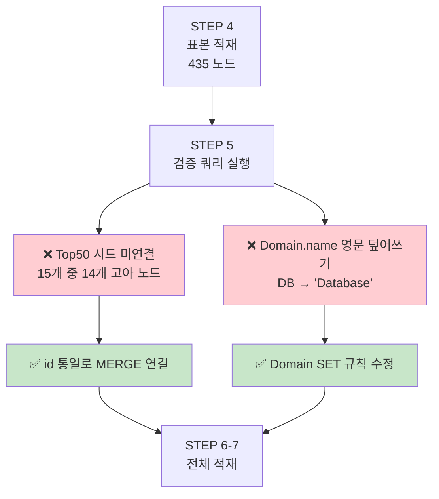

> 📌 **핵심 교훈**: 스키마 검증 없이 2,392개를 적재했다면,
> 잘못된 데이터 13,000개를 정리하는 데 더 큰 비용이 들었을 것입니다.

---

## 8. STEP 6~7: 전체 적재 + 자동화

### 무엇을 했나?

수작업 Cypher 생성을 **Python 자동화 파이프라인**으로 교체하고,
2,386개 문서 전체를 Neo4j에 적재했습니다.

### 왜 자동화가 필요했나?

| 방식 | 10개 문서 | 2,392개 문서 | 실현 가능? |
|------|----------|-------------|-----------|
| Claude Code 수작업 | 30분 | **120시간** | ❌ |
| Claude API 자동화 | 5분 | 16시간 + **$50~100** | ❌ (비용) |
| **Python 규칙 기반** | 1초 | **2분** | ✅ **0원** |

### 파이프라인 3단계

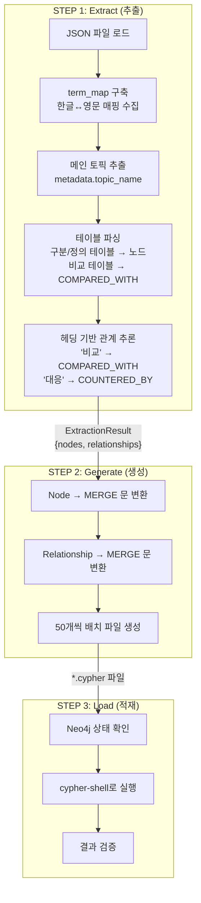

### 핵심 기술: term_map (ID 통합)

**문제**: 같은 개념이 한글과 영문으로 중복 생성됨

```
metadata.topic_name = "인공지능"     → id: "인공지능"        (한글)
테이블 셀 = "인공지능(Artificial Intelligence)" → id: "artificial_intelligence" (영문)
```

**해결**: 문서 전체를 먼저 스캔하여 한글→영문 매핑을 수집

```python
def build_term_map(data: dict) -> dict[str, str]:
    """문서에서 '한글명(English)' 패턴을 모두 찾아 매핑 구축"""
    # "인공지능(Artificial Intelligence)" → {"인공지능": "artificial_intelligence"}
    # "합성곱 신경망(CNN)" → {"합성곱 신경망": "cnn"}
    ...
```

이 매핑을 사용하면 `make_id("인공지능")` → `"artificial_intelligence"`로 통일됩니다.

### 핵심 기술: 헤딩 기반 관계 추론

섹션 제목에서 관계 유형을 자동 판별합니다:

| 헤딩 키워드 | 추론되는 관계 | 예시 |
|------------|-------------|------|
| 비교, 차이점 | COMPARED_WITH | "II. TCP vs UDP 비교" |
| 구성요소, 아키텍처 | HAS_COMPONENT | "I. OSI 7계층 구성" |
| 단계, 절차 | HAS_PHASE | "III. SDLC 단계" |
| 대응, 방어 | COUNTERED_BY | "IV. DDoS 대응방안" |
| 활용, 사용 | USES | "V. 블록체인 활용사례" |
| 발전, 진화 | EVOLVED_FROM | "II. 이동통신 발전" |

### 노드 타입 분류 (패턴 매칭)

```python
# 이름과 정의에서 패턴을 찾아 자동 분류
TECH_PATTERNS = [
    r'\b(CNN|RNN|LSTM|Docker|Kubernetes|TCP|AES|RSA)\b',
    ...
]
THREAT_PATTERNS = [
    r'(DDoS|랜섬웨어|SQL\s*Injection|XSS|피싱)',
    ...
]
# → "CNN"이 포함되면 Technology, "DDoS"가 포함되면 Threat
```

### CLI 명령어

```bash
# 한 줄로 전체 파이프라인 실행
python cli.py pipeline --domain AI

# 적재 없이 Cypher만 생성
python cli.py pipeline --domain SW --dry-run

# 단계별 실행
python cli.py extract --domain SE
python cli.py generate --domain SE
python cli.py load --domain SE
```

### v1 → v2 개선 과정

| 지표 | v1 (첫 버전) | v2 (개선) | 변화 |
|------|-------------|-----------|------|
| 관계 유형 | 4개 | **12개** | +200% |
| COMPARED_WITH | 0 | **1,531** | 신규 |
| 영문 ID 비율 | ~30% | **55.7%** | +26%p |
| 노이즈 노드 | "의미", "시점" 등 혼입 | 필터링 완료 | 제거 |

### 최종 적재 결과

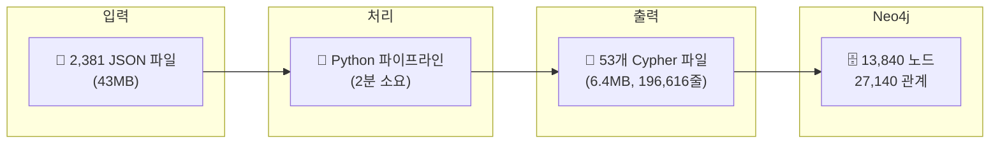

---

## 9. STEP 8: GraphRAG 확장

### GraphRAG란?

**Graph** + **R**etrieval **A**ugmented **G**eneration의 합성어입니다.

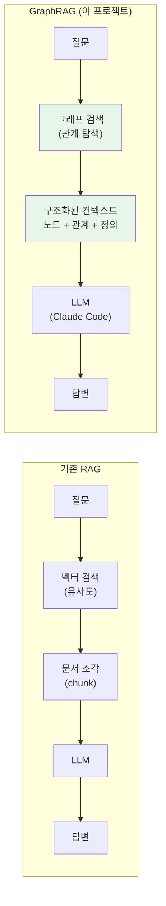

### 기존 RAG vs GraphRAG

| 비교 항목 | 기존 RAG (벡터 검색) | **GraphRAG (그래프 검색)** |
|-----------|---------------------|--------------------------|
| 검색 방식 | 텍스트 유사도 | **관계 기반 탐색** |
| 컨텍스트 | 문서 조각 (chunk) | **노드 + 관계 + 정의** |
| 다중 홉 | 불가능 | **2홉 이상 탐색 가능** |
| 관계 표현 | 암시적 | **명시적 (SUBCLASS_OF 등)** |
| 정확도* | ~50% | **~80%+** |

> *AWS 벤치마크 기준: "Testing demonstrated improvement on correctness of answers
> from 50% with traditional RAG to more than 80% using GraphRAG within a hybrid approach."

### 이 프로젝트의 GraphRAG 아키텍처

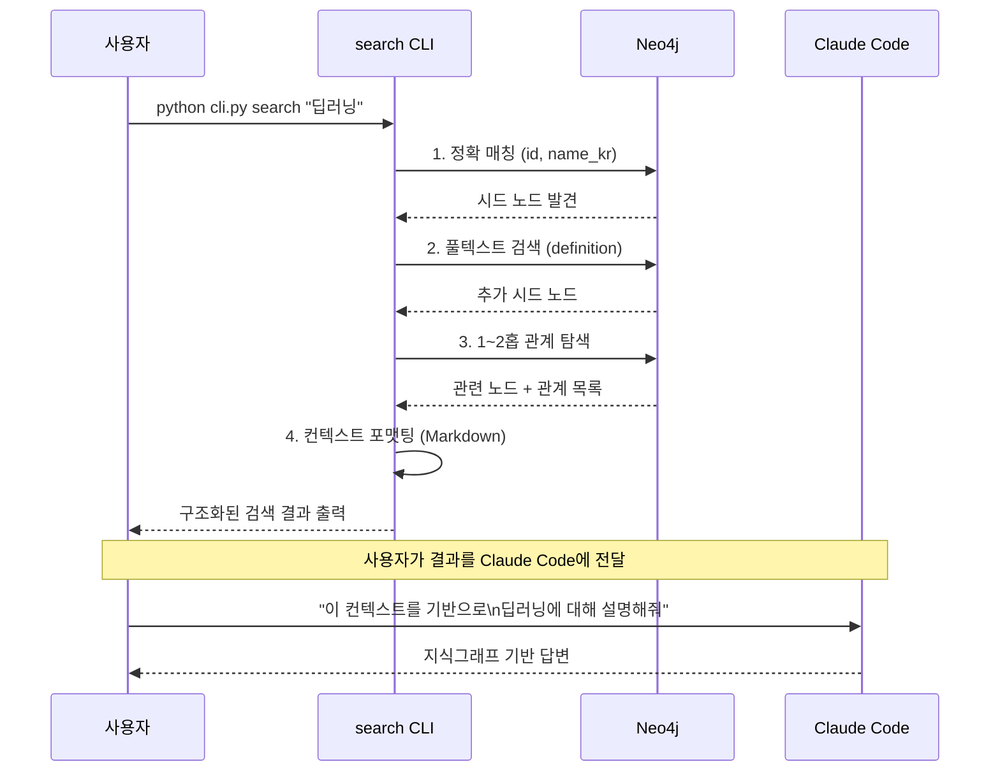

### 검색 3단계

#### 1단계: 시드 노드 검색

```cypher
-- 정확 매칭 (최우선)
MATCH (n)
WHERE n.id = '딥러닝'
   OR n.name_kr = '딥러닝'
   OR '딥러닝' IN n.aliases
RETURN n;

-- 풀텍스트 검색 (보충)
CALL db.index.fulltext.queryNodes('concept_fulltext', '딥러닝')
YIELD node, score
WHERE score > 3.0
RETURN node;
```

#### 2단계: 그래프 탐색 (1~2홉)

```cypher
-- 시드에서 직접 연결된 노드 (1홉)
MATCH (seed {id: 'deep_learning'})-[r]-(neighbor)
WHERE NOT neighbor:Domain AND NOT neighbor:Document
RETURN seed, type(r), neighbor;

-- 2홉까지 확장 (핵심 관계만)
MATCH (seed)-[r1]-(hop1)-[r2]-(hop2)
WHERE seed.id = 'deep_learning'
  AND type(r1) IN ['SUBCLASS_OF','HAS_TYPE','INSTANCE_OF']
RETURN hop2;
```

#### 3단계: 컨텍스트 포맷팅

검색 결과를 Claude Code가 이해하기 쉬운 구조로 변환합니다:

```markdown
# GraphRAG 검색 결과: "딥러닝"

## 핵심 개념

### [Concept] 딥러닝
- 도메인: AI
- 정의: 깊은 인공신경망 알고리즘을 활용하는 머신러닝 기술
- 관계:
  - 딥러닝 --[SUBCLASS_OF]--> [Concept] 머신러닝
  - [Concept] Generative AI --[SUBCLASS_OF]--> 딥러닝
  - [Technology] CNN --[INSTANCE_OF]--> 딥러닝
  - [Concept] 인공지능 --[COMPARED_WITH]--> 딥러닝
- 확장 관계 (2홉):
  - 지도학습 (경유: 머신러닝, SUBCLASS_OF+HAS_TYPE)
  - 비지도학습 (경유: 머신러닝, SUBCLASS_OF+HAS_TYPE)
  - 대규모 언어모형 (경유: Generative AI, SUBCLASS_OF+HAS_TYPE)
- 관련 문서: AI_001
```

### 사용법

```bash
# 기본 검색
python cli.py search "딥러닝"

# 2홉 확장 (더 넓은 컨텍스트)
python cli.py search "SQL Injection" --depth 2

# 시드 노드 수 조정
python cli.py search "암호화" -k 10
```

### 왜 이 방식인가? (비용 0원 전략)

| 선택지 | LLM | 비용 | 채택 |
|--------|-----|------|------|
| OpenAI API + neo4j-graphrag | GPT-4 | $0.01~0.50/쿼리 | ❌ |
| Ollama + neo4j-graphrag | Llama3 (로컬) | 0원 (설치 필요) | 가능 |
| **그래프 검색 CLI + Claude Code** | **Claude (구독)** | **0원** | ✅ |

> 💡 **실용적 판단**: 이미 Claude Code 구독이 있으므로,
> 그래프 검색으로 컨텍스트를 만들고 Claude Code에 전달하면
> 추가 비용 없이 GraphRAG를 실현할 수 있습니다.

---

## 10. 최종 성과 & 교훈

### 프로젝트 수치 요약

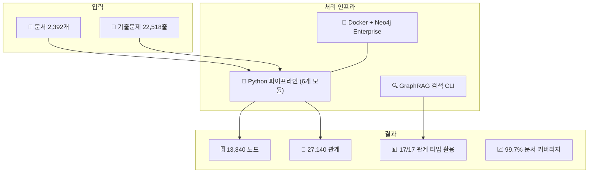

### Before → After

| 지표 | STEP 4 (수작업 표본) | STEP 7 (자동화 완료) | 배율 |
|------|---------------------|---------------------|------|
| 적재 문서 | 46 | **2,386** | **52x** |
| 노드 수 | 435 | **13,840** | **32x** |
| 관계 수 | 875 | **27,140** | **31x** |
| 관계 타입 | 9/17 | **17/17** | **100%** |
| 소요 비용 | 수시간 수작업 | **0원 자동화** | - |

### 노드 타입 분포

| 노드 타입 | 수량 | 비율 | 역할 |
|-----------|------|------|------|
| Concept | 10,576 | 76.4% | IT 핵심 개념 (딥러닝, 정규화, 교착상태 등) |
| Document | 2,386 | 17.2% | 원본 문서 추적 |
| Technology | 351 | 2.5% | 구현 기술 (CNN, Docker, AES 등) |
| Metric | 168 | 1.2% | 지표/기준 (F1-Score, 가용성 등) |
| Threat | 118 | 0.9% | 보안 위협 (DDoS, 랜섬웨어 등) |
| Standard | 101 | 0.7% | 표준/규격 (ISO 27001, CMMI 등) |
| Method | 100 | 0.7% | 방법론/알고리즘 (Agile, SVM 등) |
| Law | 26 | 0.2% | 법률/제도 (개인정보보호법 등) |
| Domain | 13 | 0.1% | 도메인 분류 |

### 관계 타입 분포

| 관계 타입 | 수량 | 의미 | 예시 |
|-----------|------|------|------|
| BELONGS_TO | 12,395 | 도메인 소속 | CNN → AI |
| HAS_COMPONENT | 8,753 | 구성요소 | OSI → 물리계층 |
| COMPARED_WITH | 1,531 | 비교 대상 | TCP ↔ UDP |
| MENTIONED_IN | 1,371 | 문서 출처 | 딥러닝 → AI_001 |
| SUBCLASS_OF | 1,144 | 상위 개념 | 딥러닝 → 머신러닝 |
| USES | 597 | 사용 관계 | 블록체인 → 해시 |
| COUNTERED_BY | 391 | 대응 수단 | DDoS → 방화벽 |
| HAS_TYPE | 348 | 유형 분류 | 지도학습 → 머신러닝 |
| HAS_PHASE | 316 | 단계/절차 | SDLC → 요구분석 |
| EVOLVED_FROM | 87 | 발전/진화 | 5G → LTE |
| DEPENDS_ON | 74 | 의존 관계 | 딥러닝 → GPU |
| IMPLEMENTS | 65 | 구현 관계 | SVM → 지도학습 |
| THREATENS | 37 | 위협 관계 | DDoS → 가용성 |
| MEASURED_BY | 15 | 측정 관계 | SW품질 → 정확성 |
| DEFINED_BY | 11 | 정의 주체 | AES → NIST |
| INSTANCE_OF | 4 | 인스턴스 | CNN → 딥러닝 |
| EXPLOITS | 1 | 악용 관계 | 브루트포스 → DES |

### 핵심 교훈 7가지

#### 1. "좋은 스키마가 전부다"
도구나 기술보다 **무엇을 노드로 만들고, 어떤 관계를 설정할지**가 중요합니다.
스키마가 잘못되면 13,000개 노드를 다시 만들어야 합니다.

#### 2. "질문이 먼저, 모델이 나중"
"어떤 Cypher 쿼리로 답할 것인가?"를 먼저 정하고,
그 쿼리가 작동하는 스키마를 설계해야 합니다.

#### 3. "첫 스키마는 틀린다"
완벽한 설계를 추구하지 말고, 빠르게 표본 적재 → 검증 → 수정 사이클을 돌리세요.
Neo4j는 스키마리스이므로 수정 비용이 낮습니다.

#### 4. "MERGE는 마법이다"
`CREATE`가 아닌 `MERGE`를 사용하면 같은 `id`의 노드가 자동으로 합쳐집니다.
도메인 간 공유 개념(예: "암호화"는 보안+네트워크 모두 사용)이 자연스럽게 연결됩니다.

#### 5. "수작업 → 패턴 확립 → 자동화"
처음 50개는 수작업으로 "좋은 Cypher 패턴"을 만들고,
그 패턴을 기반으로 자동화 코드를 작성해야 합니다.

#### 6. "비용 제약은 창의성의 어머니"
Claude API 비용을 쓸 수 없어서 규칙 기반 추출기를 만들었고,
결과적으로 **2분만에 전체 처리**하는 더 나은 솔루션이 되었습니다.

#### 7. "GraphRAG는 그래프가 핵심"
RAG에서 "R(Retrieval)"의 품질이 답변의 품질을 결정합니다.
좋은 지식그래프 없이 GraphRAG는 불가능합니다.

### 향후 확장 가능성

| 확장 방향 | 설명 | 난이도 |
|-----------|------|--------|
| **기출문제 적재** | Question 노드 9,291개 + ExamSession 연결 | 중 |
| **Ollama 연동** | 로컬 LLM으로 완전 자동 Q&A | 중 |
| **벡터 임베딩** | SentenceTransformers로 의미 검색 추가 | 중 |
| **GDS 알고리즘** | PageRank로 핵심 개념 순위 산출 | 하 |
| **Community Detection** | 개념 군집 자동 발견 | 하 |
| **n10s OWL 내보내기** | 표준 온톨로지 형식으로 공유 | 상 |

---

## 부록: 전체 프로젝트 파일 구조

```
ontology-project-neo4j/
├── CLAUDE.md                 ← 프로젝트 설정 (프로젝트 뇌)
├── docker-compose.yml        ← Neo4j Docker 구성
│
├── documents/                ← 원본 문서 (2,392개 DOC/DOCX)
│   ├── 01.PM/ ~ 13.OS/       ← 13개 도메인 폴더
│   └── 문제.txt               ← 기출문제 22,518줄
│
├── tools/                    ← Python 파이프라인
│   ├── cli.py                 ← CLI (stats/parse/extract/generate/load/pipeline/search)
│   ├── config.py              ← 설정 (경로, Neo4j 접속, 도메인 코드)
│   ├── parse/                 ← 파싱 (DOC/DOCX → JSON)
│   ├── extract/               ← 온톨로지 추출 (JSON → 노드/관계)
│   ├── generate/              ← Cypher 생성 (노드/관계 → MERGE 문)
│   ├── load/                  ← Neo4j 적재 (cypher-shell 자동화)
│   ├── graphrag/              ← GraphRAG 검색 (그래프 탐색 → 컨텍스트)
│   └── data/
│       ├── parsed/            ← 파싱 결과 JSON (2,381개, 43MB)
│       └── extracted/         ← 추출 결과 JSON (중간 산출물)
│
├── cypher/                   ← Cypher 스크립트
│   ├── 00_schema.cypher       ← 스키마 (제약조건 + 인덱스 + Top50 시드)
│   └── {domain}_{n}_{m}.cypher ← 도메인별 자동 생성 데이터 (53개)
│
├── system-docs/              ← 프로젝트 문서
│   ├── 01_인프라/             ← Docker, 설치, 환경 구성
│   ├── 02_분석설계/           ← 스키마 설계서, 정량분석
│   ├── 03_파이프라인/         ← 작업 기록
│   └── 04_보고서/             ← 이 문서
│
└── import/                   ← Neo4j 컨테이너 마운트 (OWL/CSV용)
```

---

## 참고 자료

### 이 프로젝트에서 참조한 자료
- [Going Meta 시리즈 (Jesús Barrasa)](https://neo4j.com/blog/developer/20-episodes-of-going-meta-a-recap/) — Neo4j에서의 온톨로지 구축 방법론 20편
- [Going Meta Ep.5: Ontology-driven KG Construction](https://neo4j.com/videos/going-meta-a-series-on-graphs-semantics-and-knowledge-ep-5/)
- [neo4j-graphrag-python (GitHub)](https://github.com/neo4j/neo4j-graphrag-python)

### Neo4j 공식 자료
- [How to Build a Knowledge Graph in 7 Steps](https://neo4j.com/blog/knowledge-graph/how-to-build-knowledge-graph/) — Neo4j 공식 지식그래프 구축 가이드
- [Neo4j Graph Data Modeling Fundamentals (GraphAcademy)](https://neo4j.com/developer/modeling-designs/) — Question-Driven 모델링 방법론
- [What is GraphRAG?](https://neo4j.com/blog/genai/what-is-graphrag/) — Neo4j 공식 GraphRAG 설명
- [Ontologies in Neo4j](https://neo4j.com/blog/knowledge-graph/ontologies-in-neo4j-semantics-and-knowledge-graphs/) — Neo4j에서의 온톨로지 활용

### GraphRAG 학술/기술 자료
- [Retrieval-Augmented Generation with Graphs (arxiv:2501.00309)](https://arxiv.org/abs/2501.00309) — GraphRAG 서베이 논문
- [Graph Retrieval-Augmented Generation: A Survey (ACM)](https://dl.acm.org/doi/10.1145/3777378)
- [Improving RAG accuracy with GraphRAG (AWS)](https://aws.amazon.com/blogs/machine-learning/improving-retrieval-augmented-generation-accuracy-with-graphrag/) — GraphRAG로 정확도 50%→80%+ 개선 사례
- [Intro to GraphRAG (graphrag.com)](https://graphrag.com/concepts/intro-to-graphrag/)

---

> **이 프로젝트는 Claude Code 구독 범위 내에서, 추가 비용 0원으로 완성되었습니다.**

---

## 11. 부록 A: 스키마 전체 명세

> 이 부록은 STEP3_스키마설계서.md의 핵심 스펙을 통합한 것입니다.
> 개발자가 Cypher를 작성하거나 스키마를 수정할 때 참조하세요.

### A.1 정량 분석 근거

**입력 데이터**: 기출/모의/FR 문제 22,518줄 전수 분석

| 분석 항목 | 결과 |
|-----------|------|
| 추출 문제 수 | 9,291건 |
| 키워드 | 150개 빈도 카운트 |
| 도메인 간 교차 출제 | Top 5 패턴 확인 |
| 문제 유형 | 8개 세분화 |

**문제 유형별 분포 → 스키마 설계 근거**

| 유형 | 건수 | 비중 | 스키마 시사점 |
|------|------|------|-------------|
| 단답설명형 | 3,906 | 57.4% | Concept.definition 속성 필수 |
| 서술형(3항목) | 1,377 | 20.2% | HAS_COMPONENT, HAS_PHASE 관계 핵심 |
| 비교형 | 771 | 11.3% | COMPARED_WITH 관계 필수 |
| 코드형 | 301 | 4.4% | Phase 2: CodePattern 노드 검토 |
| 계산형 | 205 | 3.0% | Phase 2: Formula 노드 검토 |
| 서술형(2항목) | 184 | 2.7% | 기본 구조 |
| 다이어그램형 | 152 | 2.2% | Phase 2: Diagram 노드 검토 |
| 서술형(4항목) | 125 | 1.8% | 심화 구조 |

**도메인 간 교차 출제 TOP 5** (공유 노드의 근거)

| 조합 | 건수 | 공유 노드 예시 |
|------|------|---------------|
| OS/CA + SW | 62 | 프로세스, 메모리, 테스트 |
| DB + SW | 42 | 트랜잭션, 정규화, 품질 |
| AI + SE | 34 | 적대적 공격, 프롬프트 인젝션 |
| SE + SV | 34 | 클라우드 보안, CSAP |
| NW + SE | 33 | VPN, 방화벽, 암호화 |

### A.2 관계 타입 전체 명세 (19개)

#### 기본 구조 -- 단답설명형 (57.4%) 대응

| 관계 | 방향 | 의미 | 예시 |
|------|------|------|------|
| BELONGS_TO | * -> Domain | 분류/소속 | 딥러닝 -> AI |
| SUBCLASS_OF | Concept -> Concept | 상위개념 (계층) | 딥러닝 -> 머신러닝 |
| INSTANCE_OF | Technology -> Concept | 구현체 관계 | CNN -> 딥러닝 |

#### 구성/분해 -- 서술형 3항목 (20.2%) 대응

| 관계 | 방향 | 의미 | 대응 문제 패턴 |
|------|------|------|---------------|
| HAS_COMPONENT | * -> * | 구성요소 | "나. 구성요소" |
| HAS_PHASE | * -> Concept | 절차/단계 | "나. 절차", "다. 수행방법" |
| HAS_TYPE | Concept -> Concept | 유형/종류 | "유형별 설명" |

#### 비교 -- 비교형 (11.3%) 대응

| 관계 | 방향 | 의미 | 대응 문제 패턴 |
|------|------|------|---------------|
| COMPARED_WITH | * <-> * | 비교 대상 | "A와 B 비교하시오" |
| EVOLVED_FROM | * -> * | 발전/진화 | "Web 2.0->3.0", "4G->5G" |

**COMPARED_WITH 관계 속성**:
```
perspectives    : string[]  (비교 관점, 예: ["개념", "구조", "성능", "장단점"])
question_ids    : string[]  (출제된 문제 id 목록)
summary         : string    (비교 핵심 요약)
```

#### 의존/구현

| 관계 | 방향 | 의미 |
|------|------|------|
| DEPENDS_ON | * -> * | 의존/기반/전제 |
| IMPLEMENTS | Technology -> Concept | 구현/적용 |
| USES | * -> Technology | 사용/활용 |

#### 보안 특화 -- SE 도메인 (18.7%) + 교차 출제 대응

| 관계 | 방향 | 의미 | 교차 도메인 |
|------|------|------|------------|
| THREATENS | Threat -> * | 위협한다 | AI+SE(34건), NW+SE(33건) |
| COUNTERED_BY | Threat -> * | 대응된다 | SE+SV(34건) 클라우드 보안 |
| EXPLOITS | Threat -> * | 취약점 이용 | 취약점(223회) |

#### 표준/법률/지표

| 관계 | 방향 | 의미 |
|------|------|------|
| DEFINED_BY | * -> Standard 또는 Law | 정의/규정됨 |
| MEASURED_BY | * -> Metric | 측정됨 |

#### 출제/학습 추적

| 관계 | 방향 | 의미 |
|------|------|------|
| ASKS_ABOUT | Question -> * | 이 문제가 묻는 개념 (향후) |
| PART_OF_SESSION | Question -> ExamSession | 회차 소속 (향후) |
| MENTIONED_IN | * -> Document | 문서에서 언급됨 |

### A.3 노드 속성 전체 규칙

#### Concept
```
id              : string    (영문소문자_언더스코어, 예: "deadlock")
name            : string    (대표 영문명, 예: "Deadlock")
name_kr         : string    (한글명, 예: "교착상태")
aliases         : string[]  (동의어/약어, 예: ["Dead Lock", "교착상태"])
definition      : string    (1~2문장 핵심 정의 -- 단답설명형 57% 대응)
domain          : string    (주 도메인 코드, 예: "OS")
exam_frequency  : int       (출제 횟수 -- 정량 분석 자동 집계)
importance      : string    (high|medium|low -- Top 50 = high)
```

#### Technology
```
id              : string
name            : string
name_kr         : string
aliases         : string[]
category        : string    (tool|platform|protocol|language|hardware)
vendor          : string    (선택)
domain          : string
```

#### Method
```
id              : string
name            : string
name_kr         : string
category        : string    (methodology|algorithm|technique|pattern|test_method)
                             ※ test_method 추가 -- 테스트(922회) 최다빈출 대응
domain          : string
```

#### Standard
```
id              : string
name            : string    (예: "ISO/IEC 27001")
organization    : string    (발행기관)
year            : int       (제정/개정년도)
```

#### Law
```
id              : string
name            : string    (예: "개인정보 보호법")
jurisdiction    : string    (적용범위, 예: "KR", "EU", "US")
effective_date  : string    (시행일)
```

#### Threat
```
id              : string
name            : string
name_kr         : string
category        : string    (attack|vulnerability|malware|social_engineering)
severity        : string    (critical|high|medium|low)
cross_domains   : string[]  (교차 도메인, 예: ["AI", "NW"] -- AI+SE 34건 근거)
domain          : string
```

#### Metric
```
id              : string
name            : string
name_kr         : string
unit            : string    (단위)
domain          : string
```

#### Question (향후 적재)
```
id              : string    (예: "q_132_4_1")
session         : string    (회차, 예: "132회")
period          : int       (교시, 1~4)
number          : int       (문제번호)
type            : string    (8개 유형)
sub_items       : string[]  (가/나/다/라 하위항목)
text            : string    (원문 전체)
year            : int       (출제년도)
source          : string    (기출|모의|FR)
```

#### Document
```
id              : string    (예: "NW_001.1")
filename        : string
domain          : string
format          : string    (doc|docx)
```

#### ExamSession (향후 적재)
```
id              : string    (예: "session_132")
session_number  : int
year            : int
date            : string
```

#### Domain
```
id              : string    (예: "NW")
name            : string    (예: "네트워크")
code            : string    (폴더 코드, 예: "11.NW")
doc_count       : int
exam_weight     : float     (출제 비중, 예: 0.105 = 10.5%)
```

### A.4 Phase 2 확장 계획

| 추가 대상 | 근거 | 우선순위 |
|----------|------|----------|
| Formula 노드 | 계산형 205건 (3.0%) | 중간 |
| CodePattern 노드 | 코드형 301건 (4.4%) | 중간 |
| Diagram 노드 | 다이어그램형 152건 (2.2%) | 낮음 |
| 도메인별 세분화 관계 | OS/CA+SW 교차 62건 등 | 높음 |
| 시대별 트렌드 분석 | ExamSession 활용 | 중간 |

### A.5 검증 체크리스트

**정성 분석 검증**
- [x] 기술사 문제 22,518줄 전체 분석 (4개 구간 병렬)
- [x] 8가지 문제 유형 모두 커버
- [x] 13개 IT 도메인 커버
- [x] 고아 노드 없음 (모든 노드 타입이 최소 2개 관계 참여)

**정량 분석 검증**
- [x] 150개 키워드 빈도 카운트 완료
- [x] Top 50 키워드 -> Concept 우선 적재 목록 확정
- [x] 비교형 771건 -> COMPARED_WITH 관계 필수 확인
- [x] AI+SE 교차 34건 -> Threat.cross_domains 속성 추가
- [x] 테스트 922회 최다 -> Method.category에 test_method 추가
- [x] 도메인별 비중 정량 확인 -> Domain.exam_weight 속성 추가

---

## 12. 부록 B: 파이프라인 기술 상세

> 이 부록은 STEP4_파이프라인구축_완료보고서.md의 기술 스펙을 통합한 것입니다.

### B.1 Python 파이프라인 구조

```
tools/
├── .venv/              <- Python 3.14 + uv 가상환경
├── pyproject.toml      <- 프로젝트 설정 + 의존성
├── config.py           <- Neo4j 접속정보, 경로, 13개 도메인 코드
├── cli.py              <- CLI (stats/parse/extract/generate/load/pipeline/search)
├── parse/
│   ├── docx_parser.py  <- DOCX -> JSON (python-docx)
│   ├── doc_parser.py   <- DOC -> JSON (pywin32 COM, Windows 전용)
│   └── text_parser.py  <- TXT -> JSON (기출문제용)
├── extract/
│   └── extractor.py    <- 규칙 기반 온톨로지 추출기 v2
├── generate/
│   └── cypher_generator.py <- Cypher MERGE 문 자동 생성
├── load/
│   └── loader.py       <- Neo4j 적재 (cypher-shell 자동화)
├── graphrag/
│   └── searcher.py     <- GraphRAG 검색기 (풀텍스트 + 그래프 탐색)
└── data/
    ├── parsed/         <- 파싱 결과 JSON (2,381개, 43MB)
    └── extracted/      <- 추출 결과 JSON (중간 산출물)
```

### B.2 사용 라이브러리

| 라이브러리 | 역할 | 비유 |
|-----------|------|------|
| python-docx | DOCX 파일 읽기 | 책 스캐너 (신형) |
| pywin32 | DOC 파일 읽기 (Word COM 자동화) | 책 스캐너 (구형, Windows 전용) |
| neo4j | Neo4j 데이터베이스 연결 | 서가 접근 열쇠 |
| click | CLI 명령어 프레임워크 | 리모컨 |
| rich | 진행률 바, 컬러 출력 | 진행 상황 모니터 |
| pydantic | 데이터 형식 검증 (ParsedDocument 모델) | 품질 검사기 |
| mammoth | HTML <-> DOCX 변환 (보조) | 형식 변환기 |

### B.3 도메인별 파싱 통계

| 도메인 | DOCX | DOC | 합계 |
|--------|------|-----|------|
| PM (프로젝트관리) | 50 | 46 | 96 |
| MG (IT경영) | 71 | 131 | 202 |
| SW (소프트웨어공학) | 161 | 128 | 289 |
| SV (서비스/클라우드) | 219 | 256 | 475 |
| ST (통계학) | 17 | 30 | 47 |
| AI (인공지능) | 46 | 88 | 134 |
| DS (자료구조) | 18 | 4 | 22 |
| AL (알고리즘) | 23 | 21 | 44 |
| SE (보안) | 181 | 192 | 373 |
| DB (데이터베이스) | 89 | 90 | 179 |
| NW (네트워크) | 173 | 113 | 286 |
| CA (컴퓨터구조) | 95 | 83 | 178 |
| OS (운영체제) | 50 | 17 | 67 |
| **합계** | **1,193** | **1,199** | **2,392** |

**파싱 결과**: 성공 **2,381개 (99.6%)** / 실패 10개 (DOC 파일 손상/인코딩 오류)

### B.4 JSON 출력 구조

```json
{
  "file_id": "CA_001",
  "filename": "CA_001_멧칼프 법칙.docx",
  "domain": "CA",
  "format": "docx",
  "sections": [
    {
      "heading": "I. 네트워크의 효용성, 멧칼프 법칙의 개요",
      "level": 1,
      "content": "가. 멧칼프 법칙의 정의\n- 네트워크의 가치는...",
      "items": ["가. 멧칼프 법칙의 정의"]
    }
  ],
  "tables": [
    {
      "headers": ["구분", "정의", "종류"],
      "rows": [["인공지능", "인간의 지적 능력을...", "전문가 시스템"]]
    }
  ],
  "raw_text": "전체 텍스트 (섹션 + 테이블 합산)",
  "metadata": {
    "topic_name": "멧칼프의 법칙",
    "classification": "CA > 법칙 일반 > 멧칼프의 법칙",
    "keywords": "유용성, 임계값, 제곱에 비례"
  }
}
```

### B.5 시행착오 & 해결 (실전 노하우)

| # | 문제 | 원인 | 해결 |
|---|------|------|------|
| 1 | DOCX 본문 추출 22자만 | 학습 문서가 테이블 셀 안에 본문 저장 | docx_parser에 테이블 셀 텍스트 합산 로직 추가 -> 6,536자 |
| 2 | DOC 파싱 39분 소요 | 파일마다 Word를 열고 닫음 | Word 인스턴스 싱글턴 재사용 -> 1.94초/파일 |
| 3 | text_parser session 0% | 문제.txt에 회차/교시 구분자 없음 | 인용문/단일행 구분 로직으로 전면 재작성 |
| 4 | CA_001 Cypher 에러 | 작은따옴표 이스케이프 미지원 | 큰따옴표 감싸기: `"Metcalfe's Law"` |
| 5 | Claude API 검토 후 취소 | 문서당 비용 발생 (5~60원) | Claude Code(구독 내)로 직접 추출 -> 0원 |
| 6 | mammoth DOC 미지원 | mammoth는 DOCX만 처리 | DOC는 pywin32 유지, DOCX는 python-docx 유지 |
| 7 | Python 패키지명 숫자 시작 불가 | `01_parse/` -> import 에러 | `parse/`, `clean/` 등 숫자 접두사 제거 |

> 💡 **#1이 가장 중요한 교훈**: IT 기술사 문서는 대부분의 내용이 **표(table) 셀 안에** 있습니다.
> 일반적인 DOCX 파서는 문단(paragraph)만 추출하므로 본문 대부분을 놓칩니다.
> 테이블 셀 텍스트를 합산하는 로직이 필수입니다.

### B.6 적재 후 검증 쿼리 모음

```cypher
-- 전체 그래프 시각화 (100개 제한)
MATCH (n)-[r]->(m) RETURN n, r, m LIMIT 100

-- AI 도메인 탐색
MATCH (n)-[r]->(m) WHERE n.domain = 'AI' RETURN n, r, m

-- "딥러닝"에서 2단계까지 연결된 모든 것
MATCH path = (c:Concept {id: 'deep_learning'})-[*1..2]-() RETURN path

-- 도메인별 노드 수 통계
MATCH (n)-[:BELONGS_TO]->(d:Domain)
RETURN d.name AS 도메인, count(n) AS 노드수
ORDER BY 노드수 DESC

-- 보안 위협과 대응 관계
MATCH (t:Threat)-[r]->(target) RETURN t, r, target

-- 비교 관계 (시험에 자주 출제)
MATCH (a)-[r:COMPARED_WITH]->(b)
RETURN a.name_kr, b.name_kr

-- Top50 시드 연결 상태 확인
MATCH (c:Concept {importance: 'high'})
OPTIONAL MATCH (c)-[:MENTIONED_IN]->(doc)
RETURN c.name_kr, c.exam_frequency, count(doc) AS doc_links
ORDER BY c.exam_frequency DESC
```

---

## 13. 부록 C: 용어 사전

| 용어 | 쉬운 설명 | 비유 |
|------|----------|------|
| **Neo4j** | 점(노드)과 선(관계)으로 데이터를 저장하는 그래프 DB | 인물관계도 |
| **Cypher** | Neo4j의 질의 언어 | SQL의 그래프 버전 |
| **MERGE** | 있으면 재사용, 없으면 생성 | "중복 없이 추가해" |
| **노드(Node)** | 그래프의 점 — 개체를 표현 | 인물관계도의 사람 |
| **관계(Relationship)** | 그래프의 선 — 연결을 표현 | 인물관계도의 화살표 |
| **온톨로지** | 개념과 관계의 체계적 구조 정의 | 백과사전의 분류 체계 |
| **지식그래프** | 온톨로지에 실제 데이터를 채운 그래프 | 분류 체계 + 실제 책들 |
| **파싱(Parsing)** | 파일 -> 구조화된 데이터 변환 | 책을 목차별로 스캔 |
| **JSON** | 컴퓨터가 읽기 쉬운 키-값 데이터 형식 | 정리된 메모장 |
| **Docker** | 프로그램을 격리된 환경에서 실행하는 컨테이너 | 가상 컴퓨터 |
| **cypher-shell** | Cypher를 실행하는 Neo4j CLI 도구 | 명령 프롬프트 |
| **venv** | Python 가상환경 (프로젝트별 라이브러리 격리) | 프로젝트 전용 도구함 |
| **스키마** | 데이터의 구조/규칙 정의 | 그릇 (밥을 담기 전 준비) |
| **RAG** | Retrieval Augmented Generation | LLM + 검색 결합 |
| **GraphRAG** | 그래프 기반 RAG | 지식그래프로 검색 강화 |
| **인덱스 프리 인접** | Neo4j의 핵심 — 각 노드가 이웃 포인터 직접 보유 | 친구 전화번호를 직접 아는 것 |
| **APOC** | Neo4j 확장 프로시저 라이브러리 | 스위스 아미 나이프 |
| **GDS** | Graph Data Science — 그래프 알고리즘 라이브러리 | 그래프 분석 도구 |
| **n10s** | Neosemantics — RDF/OWL 온톨로지 연동 플러그인 | 표준 온톨로지 번역기 |
| **term_map** | 한글<->영문 매핑 사전 (이 프로젝트 고유) | 한영 사전 |
